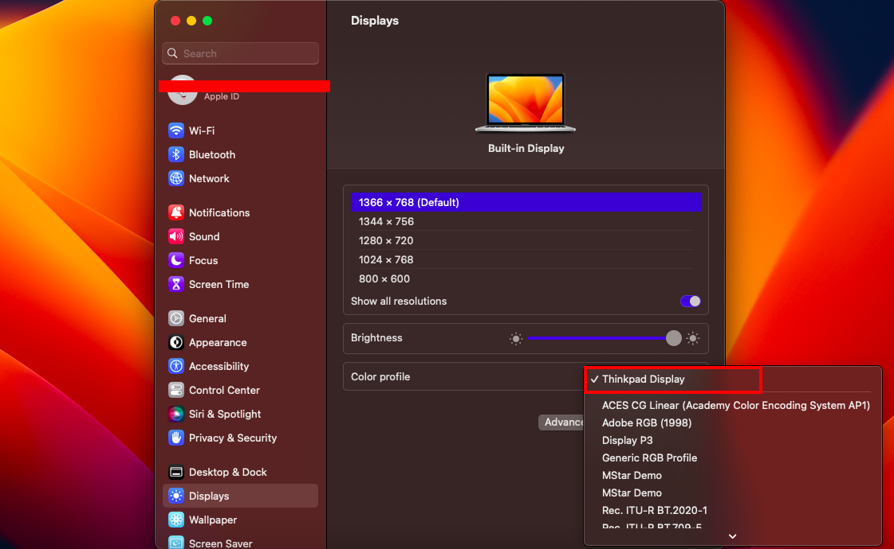
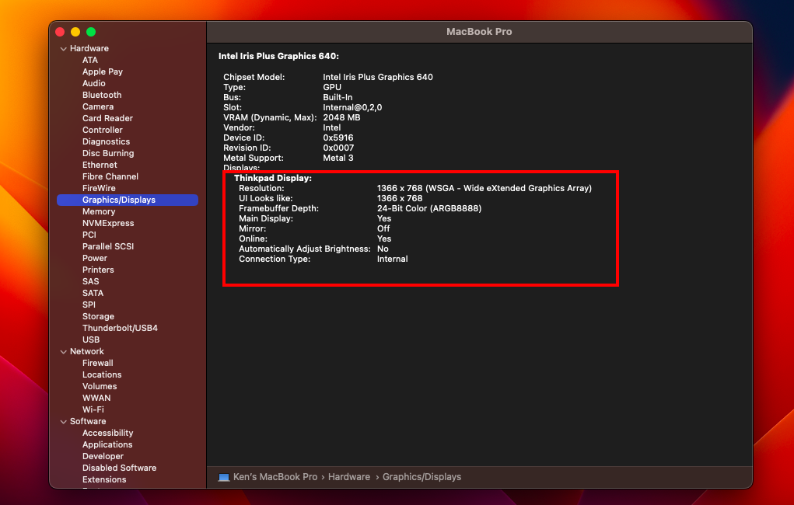

# Lenovo Thinkpad E560 OpenCore v0.9.9

Fork from rsdev69. Adding some major improvements check here on [Release Page](https://github.com/KenDxD/Lenovo-Thinkpad-E560-Hackintosh/releases) for more info 🥹.

## Please Read this!!!!

**I'm not responsible to any data loss, broken hardware or nuclear launch by North Korea. This is for `personal use only` and not for `commercial use`. Don't ever sell this config or hardware with this config, please report it to me because it's a violation to the `Apple EULA` called `Software Piracy`. I know we also broke it but people who use this config to gain money are `ULTRA PRO MAX SCUM`. This config is for the people who wants to experience the Apple ecosystem and ready to buy Apple products or `real` Apple hardware.**

## Before you use the EFI

<strong>GENERATE YOUR OWN SERIAL, ROM,MLB and UUID for iService to be working.</strong> 
Supported SMBIOS: 

 
Monterey

 
 `MacbookPro13,1`
 

 
Ventura

 
 `MacbookPro14,1`
 

 
Sonoma

 
 `MacbookPro15,2`
 

 

<strong>Warning for VoodooPS2Controller.kext</strong>
 

Don't ever update `VoodooPS2Controller.kext` because it contains patch for our Fn Key to be functional even after sleep. Follow this [guides](https://github.com/KenDxD/Lenovo-Thinkpad-E560-Hackintosh/blob/main/Custom%20patch/Guide.md) here for manual apply.   Note: This is aready included on [v2023.10.18](https://github.com/KenDxD/Lenovo-Thinkpad-E560-Hackintosh/releases/tag/v2023.10.18) release and onwards. 

**What's working currently on this patched version?** 
*- Swap Command and Option is `enabled` by default.* 
*- Fn Key that currently works.* 
`Fn + F1` for `Mute` 
`Fn + F2` for `Volume Down` 
`Fn + F3` for `Volume Up` 
`Fn + F5` for `Decrease Brightness` 
`Fn + F6` for `Increase Brightness` 

## Post-Install

 
Enabling HiDPI

  
Before we start, what is HiDPI? 
HiDPI (High Dots Per Inch) displays, also known by Apple's "Retina Display" marketing name, are screens with a high resolution in a relatively small format. They are mostly found in high-end laptops and monitors. In this way, we are forcing the Display to enable the HiDPI on non-Retina or non-Apple Hardware Display.
 
 
<strong>Instructions:</strong>
 
 
<strong>1. Enable HiDPI Mode</strong> 
 
Open your terminal and copy/paste the following command to enable HiDPI mode:
  
`sudo defaults write /Library/Preferences/com.apple.windowserver.plist DisplayResolutionEnabled -bool`

 
<strong>2. Detect Display</strong> 
 

Use IORegistryExplorerMap and locate `AppleBacklightDisplay` 

Find your `DisplayProductID` and `DisplayVendorID` 
 
If the value is equal to 
DisplayProductID = `0x46ec` 
DisplayVendorID = `0x6af` 
You can use this already made patch [DisplayProductID-46ec](https://github.com/KenDxD/Lenovo-Thinkpad-E560-Hackintosh/blob/main/Custom%20patch/DisplayProductID-46ec.plist)
 
If not, go here at [HiDPI Generator by codeclou](https://codeclou.github.io/Display-Override-PropertyList-File-Parser-and-Generator-with-HiDPI-Support-For-Scaled-Resolutions/) and make your own `.plist` by following the `Instruction 1 and 2`.

 
<strong>3. Copy to Library Folder (No SIP required)</strong> 
 
Copy this command if you download the ready made patch:

`sudo cp ~/Downloads/DisplayProductID-46ec.plist /Library/Displays/Contents/Resources/Overrides/DisplayVendorID-6af/DisplayProductID-46ec`

<strong>Note: Don't use this command if you generate your own `.plist`. Follow the guide on codeclou's site</strong>

 
<strong>4. Restart and check the changes</strong>
 
 

<strong>System Settings.app</strong>
 

 
 

<strong>System Information.app</strong>
 

 

## Running macOS

 

## What's working?

| Type               | Status   |
|:------------------:|:--------:|
| Wifi               |    ✅    |
| Bluetooth          |    ✅    |
| Sleep              |    ✅    |
| Lid                |    ✅    |
| NVRAM              |    ✅    |
| iMessage           |    ✅    |
| Facetime           |    ✅    |
| Keyboard Fn Keys   |    ✅    |
| Audio              |    ✅    |
| Touchpad           |    ✅    |
| USB 3.0 SS x 3     |    ✅    |
| VGA Port           |    ✅    |
| HDMI Port          |    ✅    |

 
 
## Hardware and Settings

| Type             | Spec                                  |
|:----------------:|:-------------------------------------:|
| Computer         | Lenovo ThinkPad E560                  |
| BIOS Version     | LENOVO v1.44                          |
| CPU              | Intel i3 6100U 2300 MHz               |
| Display          | 15.6 inch 16:9, 1360 x 768 pixel      |
| Ethernet         | Intel I219V Gigabit Ethernet          |
| Memory           | 6GB DDR3L-1600 MHz / PC3L-12800       |
| Graphics         | Intel HD Graphics 520                 |
| Audio            | Conexant HD Audio CX20753/4           |
| Touchpad         | Elan Touchpad                         |
| USB Ports        | 3 x USB 3.0                           |
| Storage          | RAMSTA SSD 128GB                      |
| Wifi             | IntelAC 3165                          |
| VGA Port         | Max Full HD 60hz                      |
| Card Reader      | 10/15 MB/s                            |
| HDMI 1.4 Ports   | Max 4k 30hz                           |

BIOS SETTINGS

| Menu       |                     |                                   | Setting       |
|:----------:|:-------------------:|:---------------------------------:|:-------------:|
| Config     | USB                 | UEFI BIOS Support                 | `Enable `     |
|            | Power               | Intel SpeedStep Technology        | `Enable `     |
|            |                     | CPU Power Management              | `Enable `     |
|            | CPU                 | Hyper-Threading Technology        | `Enable `     |
| Security   | Security Chip       |                                   | `Disable `    |
|            | Memory Protection   | Execution Prevention              | `Enable `     |
|            | Virtualization      | Intel Virtualization Technology   | `Enable `     |
|            |                     | Intel VT-d Feature                | `Enable `     |
|            | Anti-Theft          | Computrace                        | `Disable `    |
|            | Secure Boot         |                                   | `Disable `    |
|            | Intel SGX           |                                   | `Disable `    |
|            | Device Guard        |                                   | `Disable `    |
| Startup    | UEFI/Legacy Boot    |                                   | `UEFI Only`   |
|            | CSM Support         |                                   | `No`          |
|            | Boot Mode           |                                   | `Quick`       |
