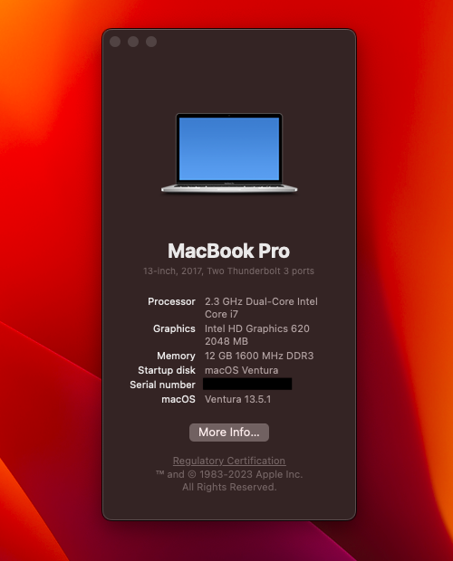

# Lenovo Thinkpad E560 OpenCore v0.9.4

This repo contains the files and scripts to install macOS on the Lenovo E560 family.

Fork from rsdev69.

## What's working?

SMBIOS: MacbookPro13,3(Monterey)
        MacbookPro15,3(Ventura)

GENERATE YOUR OWN SERIAL, ROM, MLB and UUID for iService to be working.

| Type             | Status |
|------------------|--------|
| Wifi             |    ✅  |
| Bluetooth        |    ✅  |
| Sleep            |    ✅  |
| Lid              |    ✅  |
| NVRAM            |    ✅  |
| iMessage         |    ✅  |
| Facetime         |    ✅  |
| Audio            |    ✅  |
| Touchpad         |    ✅  |
| USB 3.0 SS x 3   |    ✅  |
| VGA Port         |    ✅  |
| HDMI Port        |    ✅  |

 
## Hardware and Settings

| Type           | Spec                                |
|----------------|-------------------------------------|
| Computer       | Lenovo ThinkPad E560                |
| BIOS Version   | LENOVO v1.44                        |
| CPU            | Intel i3 6100U 2300 MHz             |
| Display        | 15.6 inch 16:9, 1360 x 768 pixel    |
| Ethernet       | Intel I219V Gigabit Ethernet        |
| Memory         | 6GB DDR3L-1600 MHz / PC3L-12800     |
| Graphics       | Intel HD Graphics 520               |
| Audio          | Conexant HD Audio CX20753/4         |
| Touchpad       | Elan Touchpad                       |
| USB Ports      | 3 x USB 3.0                         |
| Storage        | RAMSTA SSD 128GB                    |
| Wifi           | IntelAC 3165                        |
| VGA Port       | Max Full HD 60hz                    |
| Card Reader    | 10/15 MB/s                          |
| HDMI 1.4 Ports | Max 4k 30hz                         |

BIOS SETTINGS

| Menu     |                   |                                 | Setting     |
|----------|-------------------|---------------------------------|-------------|
| Config   | USB               | UEFI BIOS Support               | `Enable `   |
|          | Power             | Intel SpeedStep Technology      | `Enable `   |
|          |                   | CPU Power Management            | `Enable `   |
|          | CPU               | Hyper-Threading Technology      | `Enable `   |
| Security | Security Chip     |                                 | `Disable `  |
|          | Memory Protection | Execution Prevention            | `Enable `   |
|          | Virtualization    | Intel Virtualization Technology | `Enable `   |
|          |                   | Intel VT-d Feature              | `Enable `   |
|          | Anti-Theft        | Computrace                      | `Disable `  |
|          | Secure Boot       |                                 | `Disable `  |
|          | Intel SGX         |                                 | `Disable `  |
|          | Device Guard      |                                 | `Disable `  |
| Startup  | UEFI/Legacy Boot  |                                 | `UEFI Only` |
|          | CSM Support       |                                 | `No`        |
|          | Boot Mode         |                                 | `Quick`     |
